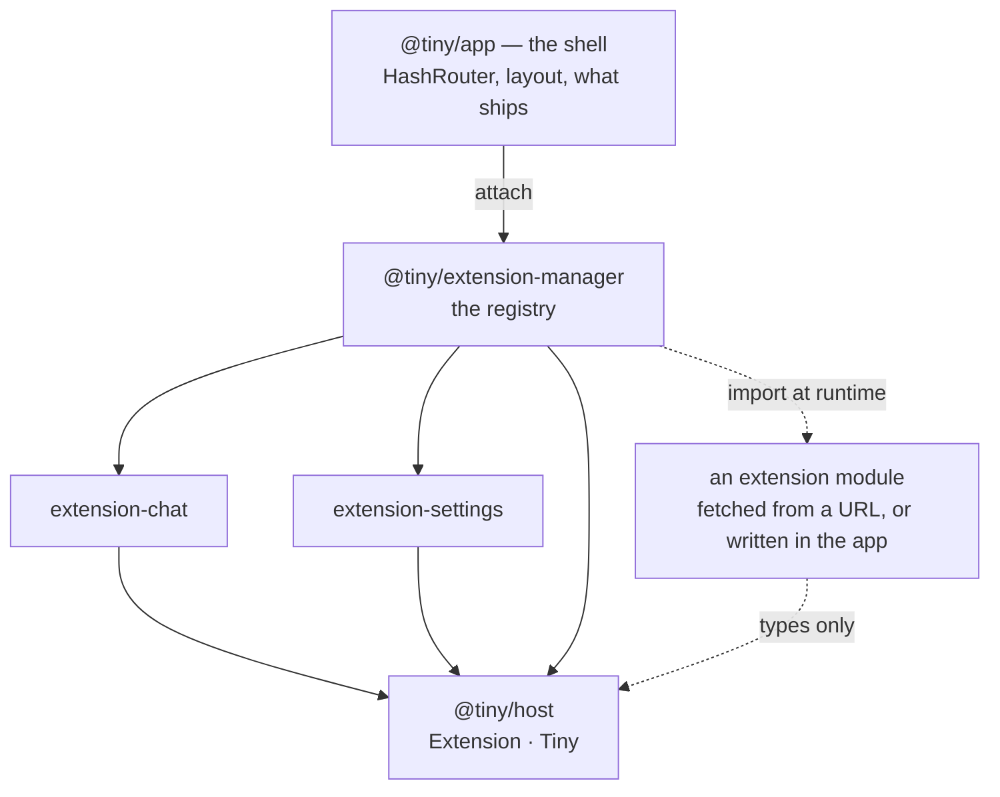

tiny is a chat app that runs entirely in a browser tab. No server, no build-time
backend, no API route in the middle: model calls go straight from the page to
whichever endpoint you configured, with your key in `localStorage` and your
conversations beside it.

The app layer is deliberately thin. The shell does three things — routing,
layout, and hosting extensions — and every actual feature is an extension.
There is one kind, and two ways to deliver it.

<CardGroup cols={2}>
  <Card title="In the build" icon="package" href="/extensions/bundling">
    A package in this repo, listed in `extensions.tsx`, shipped in the bundle. Adding one
    is a commit and a deploy.
  </Card>
  <Card title="At runtime" icon="puzzle" href="/extensions/building">
    The same module, installed by whoever is using the app, live in the next message.
  </Card>
</CardGroup>

## The shape of it

Everything either kind registers — screens, sidebar sections, tools, providers,
actions, instructions, styles — comes out of one fold in the registry. The shell
renders each live extension's `Screen` under `/#/<id>` and its optional `Sidebar`
in the left rail. That is the whole extension point. It grows only when an
extension needs a hook it cannot get today, and then by the smallest hook that
works.

## What holds it together

:::note
Two rules explain most of the design. **An extension never imports another
extension** — it takes what it needs off `tiny`, the object the app hands it.
And **a reload must not lose anything the user would care about** — what to show
is in the URL, what was typed or picked is in storage.
:::

## Where to go next

<CardGroup cols={2}>
  <Card title="Architecture" icon="layers" href="/architecture">
    The shell, storage, model calls, and the design tokens everything is drawn with.
  </Card>
  <Card title="Ship one in the build" icon="wrench" href="/extensions/bundling">
    A package, a default export, one line in `extensions.tsx`.
  </Card>
  <Card title="Build an extension" icon="code" href="/extensions/building">
    A module that default-exports a function of the host.
  </Card>
  <Card title="Reference" icon="book" href="/reference/contracts">
    Every type in the contract, and every package in the repo.
  </Card>
</CardGroup>
