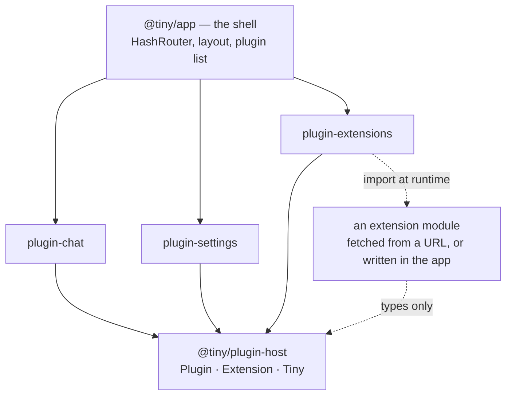

tiny is a chat app that runs entirely in a browser tab. No server, no build-time
backend, no API route in the middle: model calls go straight from the page to
whichever endpoint you configured, with your key in `localStorage` and your
conversations beside it.

The app layer is deliberately thin. The shell does three things — routing,
layout, and hosting features — and every actual feature lives somewhere else.
There are two kinds, and the only difference between them is _when_ they arrive.

<CardGroup cols={2}>
  <Card title="Plugins" icon="package" href="/plugins">
    Build time. A package in this repo, shipped in the bundle. Adding one is a
    commit and a deploy.
  </Card>
  <Card title="Extensions" icon="puzzle" href="/extensions">
    Run time. One ES module, installed by whoever is using the app, live in the
    next message.
  </Card>
</CardGroup>

## The shape of it

The shell renders each feature's `Screen` under `/#/<id>` and each feature's
optional `Sidebar` in the left rail. That is the whole extension point. It grows
only when a plugin needs a hook it cannot get today, and then by the smallest
hook that works.

## What holds it together

:::note
Two rules explain most of the design. **A feature never imports another
feature** — it exports a factory that takes what it needs, and
`packages/app/src/plugins.tsx` fills it in. And **a reload must not lose
anything the user would care about** — what to show is in the URL, what was
typed or picked is in storage.
:::

## Where to go next

<CardGroup cols={2}>
  <Card title="Architecture" icon="layers" href="/architecture">
    The shell, storage, model calls, and the design tokens everything is drawn
    with.
  </Card>
  <Card title="Build a plugin" icon="wrench" href="/plugins/building">
    A package, a `Plugin` export, one line in `plugins.tsx`.
  </Card>
  <Card title="Build an extension" icon="code" href="/extensions/building">
    A module that default-exports a function of the host.
  </Card>
  <Card title="Reference" icon="book" href="/reference/contracts">
    Every type in the contract, and every package in the repo.
  </Card>
</CardGroup>
