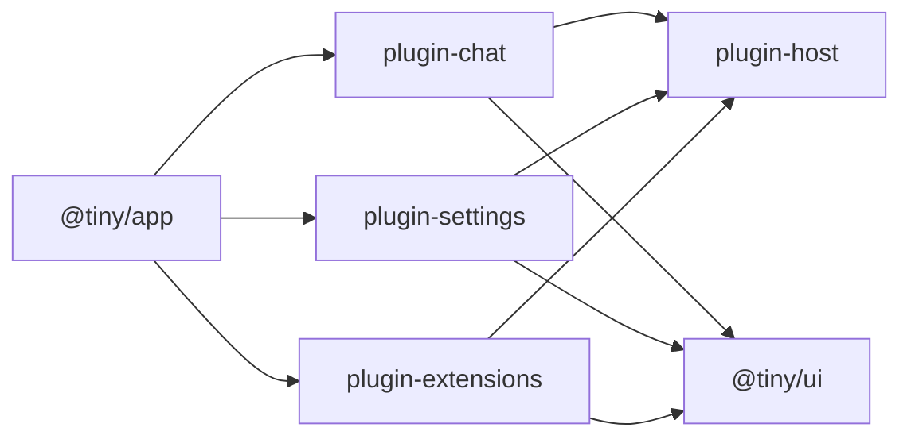

| Package                   | What it is                                              |
| ------------------------- | ------------------------------------------------------- |
| `@tiny/app`               | the shell: routing, layout, plugin list                 |
| `@tiny/ui`                | design tokens and components (shadcn + AI Elements)     |
| `@tiny/plugin-host`       | the `Plugin` and `Extension` contracts, and little else |
| `@tiny/plugin-chat`       | chat and its history, straight from the tab             |
| `@tiny/plugin-settings`   | model endpoint, API key and theme, kept on device       |
| `@tiny/plugin-extensions` | extensions you install into the running app             |
| `@tiny/extension-starter` | a working extension, and the one to copy                |

The docs site is the one thing that is not in `packages/`. It sits in `docs/`
with its own install, because Blume's `shiki@4` hoists over the `shiki@3`
`@tiny/ui` builds against — a docs toolchain has no business in the app's
dependency graph.

Each package does one thing, has a README that shows what it does, and ships
runnable example code where an example helps. Plugins are named
`plugin-<name>`, one per package — a plugin that needs a second plugin is two
packages.

## The dependency rule

No arrow between two `plugin-` packages, ever. `packages/app/src/plugins.tsx` is
where they meet, and `plugins.test.ts` fails the build if that slips.

## @tiny/ui is not on the import map

Deliberately. It has no barrel, and a barrel makes `message.tsx` reachable, which
drags in streamdown and 305 shiki chunks. Extensions style themselves with
Tailwind on the app's tokens instead.
