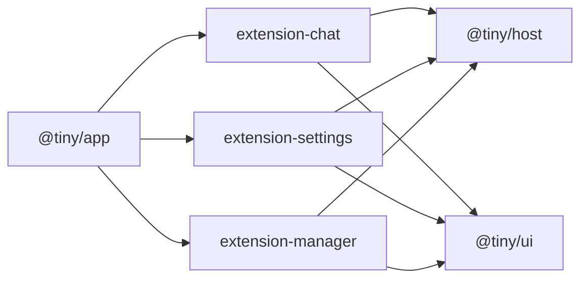

| Package                    | What it is                                          |
| -------------------------- | --------------------------------------------------- |
| `@tiny/app`                | the shell: routing, layout, the list of what ships  |
| `@tiny/ui`                 | design tokens and components (shadcn + AI Elements) |
| `@tiny/host`               | the `Extension` contract, and little else           |
| `@tiny/extension-chat`     | chat and its history, straight from the tab         |
| `@tiny/extension-settings` | model endpoint, API key and theme, kept on device   |
| `@tiny/extension-manager`  | the registry, and the screen you install one on     |
| `@tiny/extension-starter`  | a working extension, and the one to copy            |

The docs site is the one thing that is not in `packages/`. It sits in `docs/`
with its own install, because Blume's `shiki@4` hoists over the `shiki@3`
`@tiny/ui` builds against — a docs toolchain has no business in the app's
dependency graph.

Each package does one thing, has a README that shows what it does, and ships
runnable example code where an example helps. Extensions are named
`extension-<name>`, one per package — one that needs a second is two packages.
`@tiny/host` is deliberately outside that namespace: it is not an extension, it
is what they are extensions to.

## The dependency rule

No arrow between two `extension-` packages, ever. What one needs from another it
takes off `tiny`, and `extensions.test.ts` fails the build if that slips. The
rule is one predicate, which is why the host is not in the namespace — and why it
now covers `extension-starter` too.

## @tiny/ui is not on the import map

Deliberately. It has no barrel, and a barrel makes `message.tsx` reachable, which
drags in streamdown and 305 shiki chunks. Extensions style themselves with
Tailwind on the app's tokens instead.
